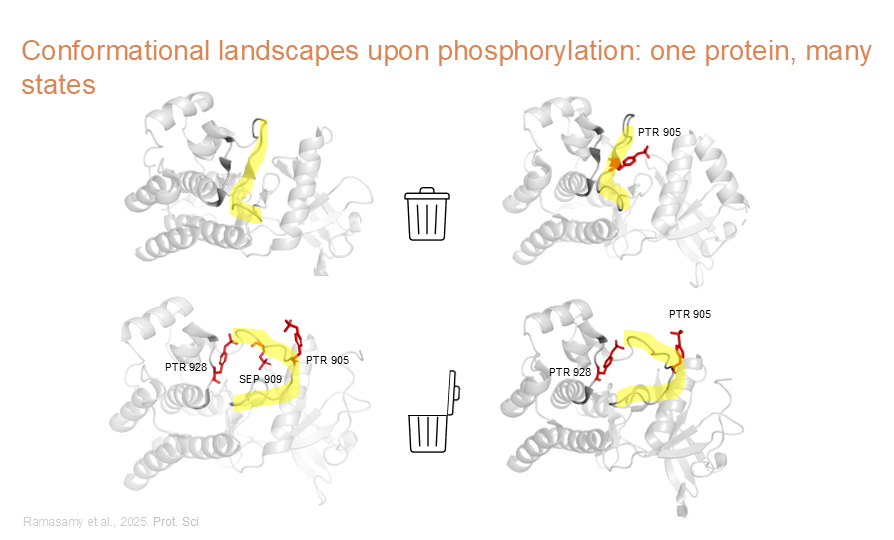
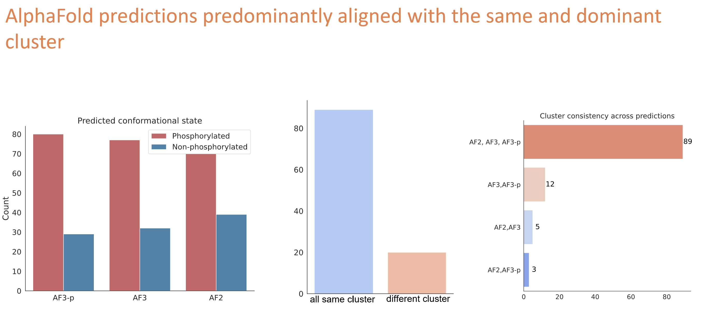

Welcome to this VIB training. The authors of this course designed a full teaching day that combines theory with hands-on activities, allowing participants to apply the concepts in practice.

!!! question "Section questions"

    1. Why do we need this training ?
    
---

## 1.1 Introducing the training methodology

The protein of interest for this training is the human **proto-oncogene tyrosine-protein kinase receptor RET**, encoded by the **RET** gene. 

1. We will predict biophysical features for this protein using the Bio2Byte online platform, specifically the **B2BTools** suite. To enable a deeper analysis of these biophysical properties, we will generate a multiple sequence alignment (MSA) of sequences sharing at least 90% identity. This alignment will be used to identify conserved and variable patterns across homologous sequences.
1. The MSA will be created using **Clustal Omega**, and the aligned kinase domain will be extracted using a **Google Colab** notebook.
1. Post-translational modifications (PTMs) for the protein of interest will be explored using the **Scop3P** online platform, which is directly linked from the B2BTools prediction results. After analyzing the available information on modifications, structures, and experimental evidence, we will follow a more detailed protocol to link biophysical patterns with PTMs.
1. Finally, the course will address the impact of mutations. We will show how to modify the wild-type sequence and assess the effect of single amino acid substitutions on biophysical profiles and predicted protein structures using **AlphaFold v3**.

!!! success "Training material: Jupyter notebooks"

    Use the following link to launch the JupyterLab environment for this training:

    [Launch JupyterLab](https://hub.compomics.com/user/bio2byte-scop3p-notebooks-euer21uw/lab/workspaces/auto-6/tree/notebooks)

    The environment may take a few minutes to build and start. Please open the link now so that it is ready when needed later in the training.

??? notes "User-interface example"

    This is how the interface will look like:

    <figure>
        
        <figcaption>JupyterLab interface.</figcaption>
    </figure>

        

## 1.2 ELIXIR Belgium node services used in this training

Belgium is part of the ELIXIR Europe network as a National Node. The Belgian node, [ELIXIR Belgium](https://www.elixir-belgium.org/), provides both federal-level services and local initiatives, including research infrastructure, domain-specific services, training activities, and workshops.

<figure>
    
    <figcaption>ELIXIR Belgium</figcaption>
</figure>

This course focuses on two bioinformatics tools and resources: **B2BTools**, used to predict and analyse protein biophysical features, and **Scop3P**, used to explore post-translational modifications (PTMs).

### 1.2.1 Introduction to Bio2Byte Tools

**DynaMine** [@dynamine] is a predictor specifically designed to estimate protein backbone dynamics. Backbone dynamics are related to, but not the same as, protein disorder. DynaMine was trained using values derived from NMR chemical shift data and therefore captures protein movements in solution. Its training set includes both fully folded proteins and intrinsically disordered proteins.

The **B2BTools** tool suite [@b2btools] extends the original DynaMine predictor by including several predictors developed by the Bio2Byte lab.

In addition to backbone dynamics, it provides predictions for side-chain dynamics and conformational preferences (alpha helix, beta sheet, and coil), all derived from NMR data and trained using the same methodology. The platform also includes predictors for early folding regions (**EFoldMine**) [@efoldmine], beta-sheet aggregation (**AgMata**) [@agmata], and protein disorder (**DisoMine**) [@disomine].

### 1.2.2 Introduction to Scop3P (and Scop3PTM)

Scop3P [@Scop3P], developed at Ghent University and available online since June 2019, is a dedicated resource to explore and interpret the impact of phosphorylation sites on human protein structure and function. It supports researchers in analysing individual phosphosites or phosphoproteins within a structural, biophysical, and biological context.

The resource integrates public data from several major international databases, including UniProtKB and the Protein Data Bank (PDB). In addition, it incorporates reprocessed mass spectrometry-based phosphoproteomics data from PRIDE/ProteomeXchange. These datasets are collected worldwide, making Scop3P a strongly international and community-driven resource.

!!! success "About the future of Scop3P and the development of Scop3PTM"
    **Scop3P is being extended to Scop3PTM**
    
    - Scop3PTM integrates information from different knowledge bases and shows how re-analysis of large scale public proteomics data sets can add an additional level of significance and confidence to the PTM-sites.
    - Scop3PTM system will provide a unique and powerful resource to understand the impact of PTM-sites on human protein structure-function relationship.
    
    Beta access is available at [https://iomics.ugent.be/scop3ptm/](https://iomics.ugent.be/scop3ptm/).

---

!!! note "Let's get started: Go to chapter 2"
    [Next chapter](/../../chapters/chapter_02) explains the biological context.

## 1.3 Rethinking the protein structure and function 

From "Assessing the relation between protein phosphorylation, alphafold3 models, and conformational variability" [@ptms-af3]:

> Proteins perform diverse functions critical to cellular processes. Transitions between functional states are often regulated by post-translational modifications (PTMs) such as phosphorylation, which dynamically influence protein structure, function, folding, and interactions. Dysregulation of PTMs can therefore contribute to diseases such as cancer and Alzheimer's. However, the structure–function relationship between proteins and their modifications remains poorly understood due to a lack of experimental structural data, the inherent diversity of PTMs, and the dynamic nature of proteins. 

> Recent advances in deep learning, particularly AlphaFold, have transformed protein structure prediction with near-experimental accuracy. However, it remains unclear whether these models can effectively capture PTM-driven conformational changes, such as those induced by phosphorylation. Here, we systematically evaluated AlphaFold models (AF2, AF3-non phospho, and AF3-phospho) to assess their ability to predict phosphorylation-induced structural diversity. By analyzing experimentally derived conformational ensembles, we found that all models predominantly aligned with dominant structural states, often failing to capture phosphorylation-specific conformations. Despite its phosphorylation-aware design, AF3-phospho predictions provided only modest improvement over AF2 and AF3-non phospho predictions. 

> Our findings highlight key challenges in modeling PTM-driven structural landscapes and underscore the need for more adaptable structure prediction frameworks capable of capturing modification-induced conformational variability.

### 1.3.1 Proteins are dynamic systems, not static objects

<figure>
    
</figure>

### 1.3.2 Limitations of deep learning–based structure prediction

<figure>
    
</figure>

<figure>
    
</figure>

### 1.3.3 Memorization and dominant conformations

<figure>
    
</figure>
