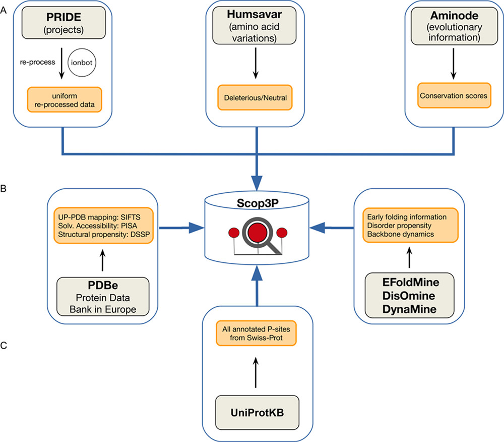
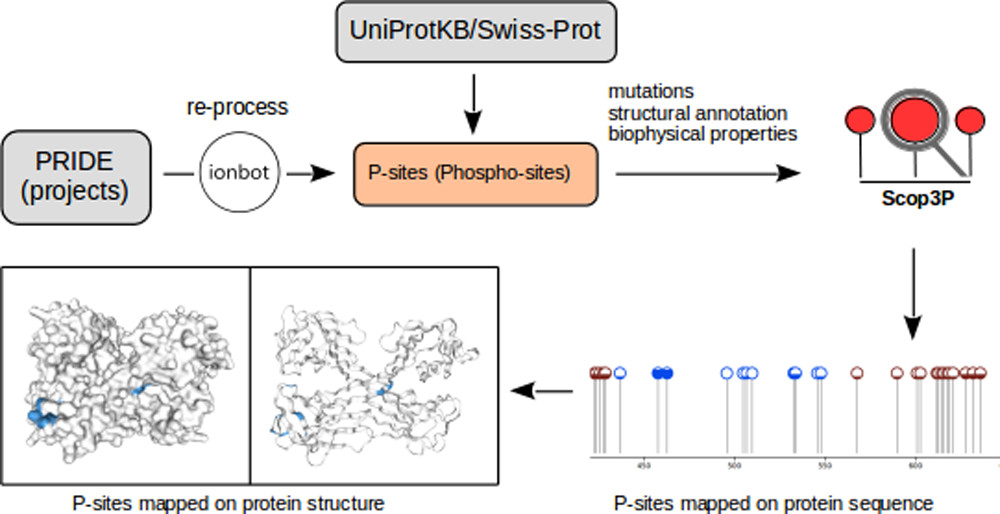

Protein phosphorylation is a key post-translational modification involved in many biological processes and is strongly associated with human diseases such as cancer and metabolic disorders.

Accurate identification, annotation, and functional analysis of phosphorylation sites (phosphosites) are therefore essential to understand their biological roles. Phosphosites are mainly studied using phosphoproteomics approaches, which have produced large amounts of publicly available data. Several resources have been developed to collect and organize phosphosite information, but most of them focus primarily on protein sequences and basic site-level metadata.

What is often missing from these resources is biological and structural context, including mapping to protein structures, experimental provenance, and biophysical annotations.

ScoP3P addresses this gap by integrating protein sequences (UniProtKB/Swiss-Prot), structural data (PDB), and uniformly reprocessed phosphoproteomics datasets (PRIDE) to annotate all known human phosphosites. In addition, each phosphoprotein is enriched with per-residue biophysical annotations, including structural propensity, solvent accessibility, disorder probability, and early folding regions.

<figure>
    
    <figcaption> Different data sources integrated into Scop3P. </figcaption>
</figure>

ScoP3P, available at [https://iomics.ugent.be/scop3p](https://iomics.ugent.be/scop3p), provides a dedicated platform for the visualization and analysis of phosphosites and supports the study of phosphosite–structure–function relationships.

<figure>
    
    <figcaption> Schematic representation of the Scop3P resource. </figcaption>
</figure>

!!! question "Chapter questions"

    1. How should Scop3P information be interpreted for a given protein target?
    2. How can PTMs be linked to structural data, such as predicted models or experimental structures from the PDB?
    
---

## 3.1 Exploring experimentally supported PTMs
Here you can enter text and if you need to cite[@creative_commons_2022]

!!! example "Hands-on: Challenge 1"

    This is an example of text of Challenge 1

    ??? success "Solution"

        This is an example solution for Challenge 1.

## 3.2 Mapping PTMs onto predicted structures

!!! example "Hands-on: Challenge 2"

    This is an example of text of Challenge 1

    ??? success "Solution"

        This is an example solution for Challenge 1.

---

!!! note "To be continued: Go to chapter 5"
    [Next chapter](/../../chapters/chapter_05) explains how to connect PTMs to biophysical profiles.
