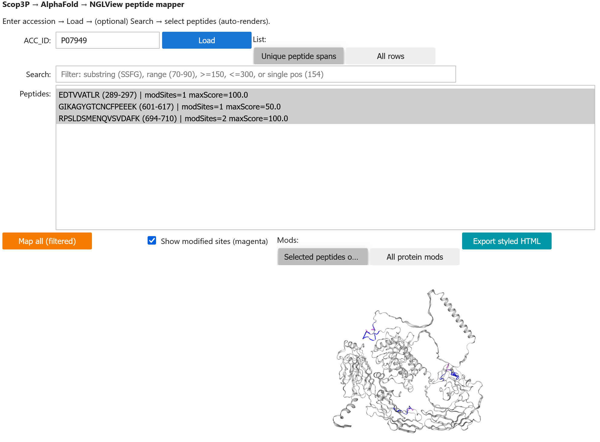
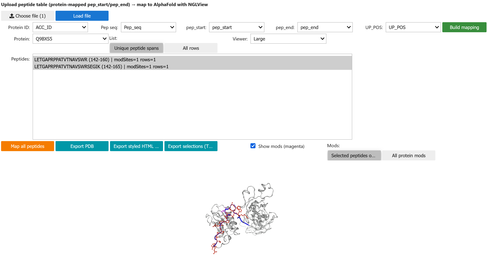
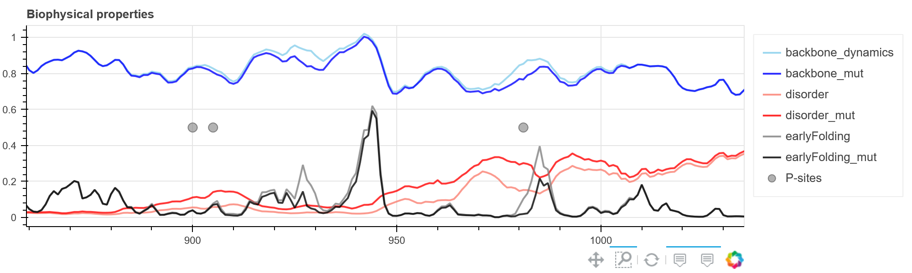
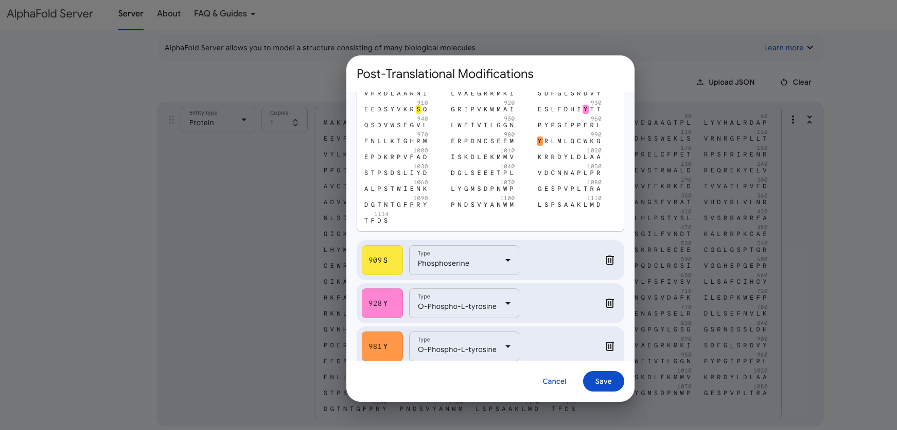

!!! question "Chapter questions"

    1. How can biophysical predictions help to interpret the functional impact of phosphosites?
    2. How to evaluate the impact of mutations using these tools?
    
## 5.1 Structural and biophysical interpretation of PTMs and mutations 

This activity gives an overview of exploring PTMs, mutations, biophysical properties on protein structures. 

!!! example "Hands-on: Structural and biophysical interpretation of PTMs and mutations"
    
    For this activity open the interactive notebook here: 
    
    | Notebook (JupyterLab) | Interactive app (Voilà) |
    |----------------------|--------------------------|
    | [](https://binder.compomics.com/v2/gh/Bio2Byte/Scop3P-notebooks/HEAD?filepath=notebooks/Scop3P_PTM_structure_viz_voila_app.ipynb) | [](https://binder.compomics.com/v2/gh/Bio2Byte/Scop3P-notebooks/HEAD?urlpath=voila/render/notebooks/Scop3P_PTM_structure_viz_voila_app.ipynb) |

    > ⚠️ **Chrome users**:  
    > Please open the *Notebook (JupyterLab)* link first to authenticate,  
    > then launch the *Interactive app (Voilà)*.


    
    1. Fetch PTMs from Scop3P REST API
    1. Fetch diseases variants from UniProt REST API
    1. Map PTMs to experimental and predicted protein structures
    1. Predict the biophysical properties and visualise them on protein structures
    1. Explore protein structures as residue-interaction network (RIN)
        1. Constructing the RINs 
        1. Exploring PTMs and mutation on the network


    ??? success "Solution"
    
        <figure>
            
            <figcaption> Different results using the provided notebook </figcaption>
        </figure>

## 5.2 Visualize the experimental peptide coverage on protein structures

!!! example "Hands-on: Peptide mapper"

    For this activity open these interactive notebooks: 
    
    1. To fetch phospho peptides from Scop3P and map onto protein structures click one of the link below: 

        | Notebook (JupyterLab) | Interactive app (Voilà) |
        |------------------------|--------------------------|
        | [](https://binder.compomics.com/v2/gh/Bio2Byte/Scop3P-notebooks/HEAD?filepath=notebooks/Peptide_mapper_scop3p_voila.ipynb) | [](https://binder.compomics.com/v2/gh/Bio2Byte/Scop3P-notebooks/HEAD?urlpath=voila/render/notebooks/Peptide_mapper_scop3p_voila.ipynb) |
        
    > ⚠️ Chrome users: open the Notebook link first to authenticate, then launch the app.


    1. To upload your own data (Peptide table) and visualize the peptides and modifications on protein structures click one of the link below: 
    
        | Notebook (JupyterLab) | Interactive app (Voilà) |
        |------------------------|--------------------------|
        | Upload your own peptides | [](https://binder.compomics.com/v2/gh/Bio2Byte/Scop3P-notebooks/HEAD?filepath=notebooks/Peptide_mapper_fileupload_voila.ipynb) | [](https://binder.compomics.com/v2/gh/Bio2Byte/Scop3P-notebooks/HEAD?urlpath=voila/render/notebooks/Peptide_mapper_fileupload_voila.ipynb) |

    > ⚠️ Chrome users: open the Notebook link first to authenticate, then launch the app.

    
    ??? success "Solution for Peptide mapper.ipynb"
        
        Fetch phospho peptides from Scop3P and map onto protein structures:
        
        1. Open the notebook on Google Colab.
        1. Import the required packages.
        1. Follow the steps of the interactive form.
            1. Enter the protein ID (ex: P07949) and click 'Load'
            1. The app will let you choose between all peptides ('All rows') and unique spans (the peptide ranges are merged)
            1. Map all petides on the AF structure using 'Map all' (shows the mass spec coverage of your protein)
            1. Alternatively click one or multiple peptides on peptide panel to see their structural mapping
            1. Hint:
                - Explore what the search function does!
                
        !!! notes "Example"
        
            <figure>
                
                <figcaption> </figcaption>
            </figure>
        
    ??? success "Solution for Peptide_maper_fileupload.ipynb"
    
        Upload your own data (Peptide table) and gets a peptide file and visualize the peptides and modifications on protein structures
        
        1. Open the notebook on Google Colab.
        1. Import the required packages.
        1. Follow the steps of the interactive form.
            1. Choose peptide file (tsv/tab delimkited text file)  and click 'Load file'
            1. The app will autofill the columns using keywords or enter the column headers
                1. (protein ID column name [ACC_ID], peptide seq column name [pep_seq] and the modified position column name [UP_POS]
            1. Click 'Build mapping'
            1. Select the protein from list for which you want to map the peptides (note: these proteins are identified in your sample)
            1. Map all petides on the AF structure using 'Map all' (shows the mass spec coverage of your protein)
            1. Alternatively click one or multiple peptides on peptide panel to see their structural mapping
            1. Hint:
                - Explore what the search function does! 
            
        
        !!! notes "Example"
        
            <figure>
                
                <figcaption> </figcaption>
            </figure>
        

## 5.3 Comparative biophysical analysis of wild-type and variant states

For this activity we will mutate three positions of P07949:

1. Mutate the position 909: `S909P`
    * Wild: Serine (**SER**, **S**)
    * Variant: Proline (**PRO**, **P**)
1. Mutate the position 928: `Y928P`
    * Wild: Tyrosine (**TYR**, **Y**)
    * Variant: Proline (**PRO**, **P**)
1. Mutate the position 981: `Y981P`
    * Wild: Tyrosine (**TYR**, **Y**)
    * Variant: Proline (**PRO**, **P**)  

??? info "Mutant sequence (FASTA)"
    This is an variant sequence in FASTA format for the **three mutations** (S909P, Y928P, Y981P):

    ```fasta
    >sp|P07949| Mutated S909P Y928P Y981P
    MAKATSGAAGLRLLLLLLLPLLGKVALGLYFSRDAYWEKLYVDQAAGTPLL
    YVHALRDAPEEVPSFRLGQHLYGTYRTRLHENNWICIQEDTGLLYLNRSLD
    HSSWEKLSVRNRGFPLLTVYLKVFLSPTSLREGECQWPGCARVYFSFFNTS
    FPACSSLKPRELCFPETRPSFRIRENRPPGTFHQFRLLPVQFLCPNISVAY
    RLLEGEGLPFRCAPDSLEVSTRWALDREQREKYELVAVCTVHAGAREEVVM
    VPFPVTVYDEDDSAPTFPAGVDTASAVVEFKRKEDTVVATLRVFDADVVPA
    SGELVRRYTSTLLPGDTWAQQTFRVEHWPNETSVQANGSFVRATVHDYRLV
    LNRNLSISENRTMQLAVLVNDSDFQGPGAGVLLLHFNVSVLPVSLHLPSTY
    SLSVSRRARRFAQIGKVCVENCQAFSGINVQYKLHSSGANCSTLGVVTSAE
    DTSGILFVNDTKALRRPKCAELHYMVVATDQQTSRQAQAQLLVTVEGSYVA
    EEAGCPLSCAVSKRRLECEECGGLGSPTGRCEWRQGDGKGITRNFSTCSPS
    TKTCPDGHCDVVETQDINICPQDCLRGSIVGGHEPGEPRGIKAGYGTCNCF
    PEEEKCFCEPEDIQDPLCDELCRTVIAAAVLFSFIVSVLLSAFCIHCYHKF
    AHKPPISSAEMTFRRPAQAFPVSYSSSGARRPSLDSMENQVSVDAFKILED
    PKWEFPRKNLVLGKTLGEGEFGKVVKATAFHLKGRAGYTTVAVKMLKENAS
    PSELRDLLSEFNVLKQVNHPHVIKLYGACSQDGPLLLIVEYAKYGSLRGFL
    RESRKVGPGYLGSGGSRNSSSLDHPDERALTMGDLISFAWQISQGMQYLAE
    MKLVHRDLAARNILVAEGRKMKISDFGLSRDVYEEDSYVKRPQGRIPVKWM
    AIESLFDHIPTTQSDVWSFGVLLWEIVTLGGNPYPGIPPERLFNLLKTGHR
    MERPDNCSEEMPRLMLQCWKQEPDKRPVFADISKDLEKMMVKRRDYLDLAA
    STPSDSLIYDDGLSEEETPLVDCNNAPLPRALPSTWIENKLYGMSDPNWPG
    ESPVPLTRADGTNTGFPRYPNDSVYANWMLSPSAAKLMDTFDS
    ```
    
    :fontawesome-regular-floppy-disk: You could save the mutant as "P07949_s909p_y928p_y981p.fasta" in your working directory: 
        
    ```bash
    ./training-data-directory
    │─── P07949.fasta
    │─── P07949.90-similar.fasta
    │─── P07949.90-similar.msa.fasta
    │─── P07949.90-similar.msa.kinase.fasta
    └─── P07949_s909p_y928p_y981p.fasta
    ```
    
<iframe src="https://molstar.org/stories-viewer/v1?story-id=6bde1abc&data-format=mvsx" style="width:1280px; height:720px; border:none;" title="Mol* Stories Viewer" allow="autoplay"></iframe>

### 5.3.1 Explore the effect of mutations (biophysical inference)
        
!!! example "Hands-on: Explore the effect of mutations (biophysical inference)"
    
    For this activity open the Jupyter Lab or interactive app here: 

    | Notebook (JupyterLab) | Interactive app (Voilà) |
    |----------------------|--------------------------|
    | [](https://binder.compomics.com/v2/gh/Bio2Byte/Scop3P-notebooks/HEAD?filepath=notebooks/Scop3P_b2b_mutation_effect_voila_app.ipynb) | [](https://binder.compomics.com/v2/gh/Bio2Byte/Scop3P-notebooks/HEAD?urlpath=voila/render/notebooks/Scop3P_b2b_mutation_effect_voila_app.ipynb) |


    > ⚠️ Chrome users: open the Notebook link first to authenticate, then launch the app.

    
    1. Predict the biophysical properties for the wild type
    1. Predict the biophysical properties for the mutant `S909P Y928P Y981P`
    
    ??? success "Solution"
        
        1. The notebook requires the positions to mutate (comma-separated values) and the amino acids (comma-separated values).
        1. Predict the biophysical properties for the mutations
        1. Compare the biophysical properties between the wild type and mutant sequences.
        1. Infer the impact of mutations.
        
        <figure>
            
            <figcaption> Biophysics changes </figcaption>
        </figure>
    
### 5.3.2 Explore the effect of mutations (structural inference)

Regarding the coordinate files for the structures, the predicted model by AlphaFold can be accessed directly from the AlphaFold Protein Structure Database. 

!!! example "Hands-on: Downloading the experimental and predicted models"
    
    1. Download the experimental structure 6NJA for the phosphorylated kinase in PDB format (`6nja.pdb`)
    1. Download the experimental structure 2IVS for the non-phosphorylated kinase in PDB format (`2ivs.pdb`)
    1. Download the predicted structure AF-P07949-F1 for the AlphaFold model in PDB format (`AF-P07949-F1.pdb`)
    1. For the mutant and phospho structures, you will predict them in the next activity using AlphaFold Server.
    
    ??? success "Solution"
        
        **For the experimental structure 6NJA:**
        
        1. Visit the entry for 6NJA on the European Protein Data Bank: [https://www.ebi.ac.uk/pdbe/entry/pdb/6nja](https://www.ebi.ac.uk/pdbe/entry/pdb/6nja)
        1. Click on "Download file" and select "PDB file"
        
        **For the experimental structure 2IVS:**
        
        1. Visit the entry for 2IVS on the European Protein Data Bank: [https://www.ebi.ac.uk/pdbe/entry/pdb/2ivs](https://www.ebi.ac.uk/pdbe/entry/pdb/2ivs)
        1. Click on "Download file" and select "PDB file"
        
        **For the predicted structure:**
        
        1. Visit the [AlphaFold Protein Structure Database](https://alphafold.ebi.ac.uk) and query the canonical structure by UniProt ID.
        1. Download the structure in PDB format (`.pdb` extension) to your working environment.
            1. The canonical predicted structure is available on [https://alphafold.ebi.ac.uk/entry/AF-P07949-F1](https://alphafold.ebi.ac.uk/entry/AF-P07949-F1).

    :fontawesome-regular-floppy-disk: You should now have these files in your working directory: 
        
    ```bash
    ./training-data-directory
    │─── P07949.fasta
    │─── P07949.90-similar.fasta
    │─── P07949.90-similar.msa.fasta
    │─── P07949.90-similar.msa.kinase.fasta
    │─── P07949_s909p_y928p_y981p.fasta
    │─── AF-P07949-F1-model_v6.pdb
    │─── 6nja.pdb 
    └─── 2ivs.pdb
    ```
        
The next step is to predict the variant structures using [AlphaFold 3 server](https://alphafoldserver.com).

!!! warning "Google account required"
    You must log in using a Google account to enqueue structural prediction jobs. By default, you can use your "@gmail.com" address.

!!! example "Hands-on: Predicting the variant structures using AlphaFold server"

    1. Open the AlphaFold Server at [https://alphafoldserver.com](https://alphafoldserver.com) and log in using your Google Account. By default you are entitled with 30 jobs. 
    1. Add the sequence for `P07949_S909P_Y928P_Y981P` in the "Server" form with a single copy. 
        1. Continue and preview the job to submit it as "P07949_S909P_Y928P_Y981P".
    1. Add the wild type sequence for `P07949` in the "Server" form
        1. Add a "Phosphoserine" modification on the position 909.
        1. Add a "O-Phospho-L-tyrosine" modification on the position 928.
        1. Add a "O-Phospho-L-tyrosine" modification on the position 981.
        1. Continue and preview the job to submit it as "P07949_modifications".
    1. Download the `model_0` files after they are predicted.
    1. Convert the mmCIF files to PDB format using the convert tool ["cif2pdb"](https://project-gemmi.github.io/wasm/convert/cif2pdb.html).

    ??? success "Solution"
        
        **Standard prediction:**
        
        The enqueued job will be listed in the jobs table below the "Continue and review job" blue button. Once the job is completed, you can click on the job row to open the results page.
        
        From the results page you can download the model files in ZIP format to your working environment including structures and their associated confidence values:
        
        - Five .cif files named fold_<job_name>_model_<N>cif, where "<N>" is the rank of the predicted structure. Structures are ranked from 0 to 4, where 0 has the highest confidence. The .cif files contain predicted structures in the mmCIF format. They can be viewed in any molecular viewer like PyMOL or ChimeraX.
        - Five .json files named fold_<job_name>_summary_confidences_<N>.json, where "<N>" is the rank of the predicted structure from 0 to 4. These .json files contain summaries of the confidence metrics for the predictions (see below for more details on confidence metrics).
        - Five .json files named fold_<job_name>_full_data_<N>.json, where "<N>" is the rank of the predicted structure from 0 to 4. These .json files contain detailed confidence metrics, such as full PAE data, for the predictions (see below for more on confidence metrics).
        - A file named fold_<job_name>_job_request.json. This contains the inputs of the modelling job and could be used to re-run the job (for more details, see Advanced use of AlphaFold Server).
        - A file named terms_of_use.md. This is a legal document detailing the terms of use for the predictions. 

        Select the model_0 mmCIF file (`.cif`) to work with the model that has the highest confidence.
        
        **Adding PTMs:**
        
        1. Click on the "..." button to show the contextual menu.
        1. Select "+ PTMS" to open the "Post-Translational Modifications".
        1. Click on the position of interest to highlight it.
        1. Select from the list the type of modification
        
        <figure>
            
            <figcaption> Biophysics changes </figcaption>
        </figure>
        
    :fontawesome-regular-floppy-disk: You should now have these files in your working directory: 
        
    ```bash
    ./training-data-directory
    │─── P07949.fasta
    │─── P07949.90-similar.fasta
    │─── P07949.90-similar.msa.fasta
    │─── P07949.90-similar.msa.kinase.fasta
    │─── P07949_s909p_y928p_y981p.fasta
    │─── AF-P07949-F1-model_v6.pdb # AlphaFold model for P07949 in PDB format
    │─── 6nja.pdb # Experimental structure for 6NJA in PDB format
    │─── 2ivs.pdb # Experimental structure for 2IVS in PDB format
    │─── fold_p07949_modifications_model_0.cif # AlphaFold server prediction for phospho
    │─── fold_p07949_modifications_model_0.pdb # AlphaFold server prediction for phospho
    │─── fold_p07949_s909p_y928p_y981p.cif # AlphaFold server prediction for mutations
    └─── fold_p07949_s909p_y928p_y981p.pdb # AlphaFold server prediction for mutations
    ```

Now the files are ready to be processed, let's continue to the next activity.
 
!!! example "Hands-on: Structural inference"
    
    For this activity open the Jupterlabl or interactive App here and go to Tab 6) TM-align:  
    
     | Notebook (JupyterLab) | Interactive app (Voilà) |
    |----------------------|--------------------------|
    | [](https://binder.compomics.com/v2/gh/Bio2Byte/Scop3P-notebooks/HEAD?filepath=notebooks/Scop3P_PTM_structure_viz_voila_app.ipynb) | [](https://binder.compomics.com/v2/gh/Bio2Byte/Scop3P-notebooks/HEAD?urlpath=voila/render/notebooks/Scop3P_PTM_structure_viz_voila_app.ipynb) |

    > ⚠️ **Chrome users**:  
    > Please open the *Notebook (JupyterLab)* link first to authenticate,  
    > then launch the *Interactive app (Voilà)*.

    1. Aligning and exploring protein structures
        1. predicted vs experimental
        1. phospho vs non-phospho
        1. mutated vs wild type
    
    ??? success "Solution"

        1. Predicted vs Experimental (phospho)
            1. Use the unmodified Alphafold model (`AF-P07949-F1.pdb`) vs 6NJA experimental structure (`6nja.pdb`)
        1. Experimental phospho vs experimental non-phospho
            1. 6NJA experimental structure vs 2IVS experimental structure (`2ivs.pdb`)
        1. Predicted Wild type vs predicted mutated
            1. Use the unmodified Alphafold model (`AF-P07949-F1.pdb`) vs the AlphaFold server mutated structure (`P07949_S909P_Y928P_Y981P.pdb`)
        1. Predicted Wild type vs predicted phospo
            1. Use the unmodified Alphafold model (`AF-P07949-F1.pdb`) vs the AlphaFold server phospho structure (`P07949_modifications.pdb`)


---

!!! warning "☕️ COFFEE BREAK"
    Time to grab a coffee or tea. We'll be back in ten minutes... Please stay for the closing session (feedback much appreciated)

---

!!! note "To conclude: : Go to chapter 5"
    [Next chapter](/../../chapters/chapter_05) wraps up all the learnings and hands on activities.
